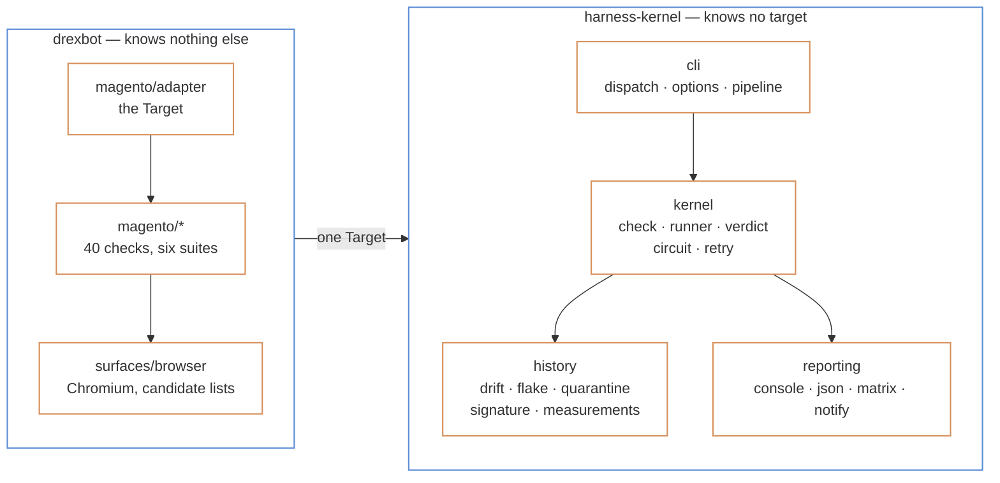
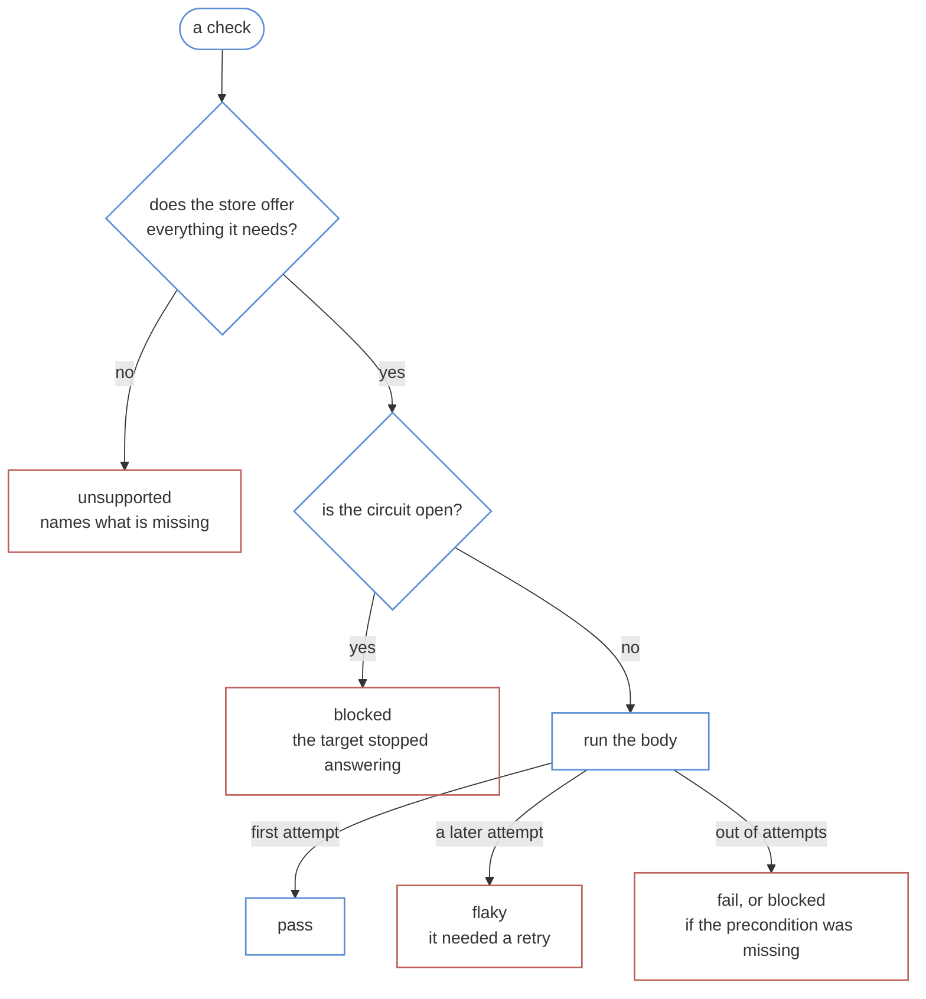

# Architecture

One kernel that has never heard of Magento, one adapter that knows nothing else, and a contract of seven methods between them.

> [!NOTE]
> The split isn't a directory naming convention. `harness-kernel` is a separate package with a separate repository, and the only thing drexbot can reach is what that package exports from its `src/index.ts`. A layering mistake isn't a lint warning here — it's an import that doesn't resolve.

## Contents

- [The one rule](#the-one-rule)
- [The line down the middle](#the-line-down-the-middle)
- [What a target has to answer](#what-a-target-has-to-answer)
- [What happens to one check](#what-happens-to-one-check)
- [The modules worth knowing](#the-modules-worth-knowing)
- [Six things that are deliberate](#six-things-that-are-deliberate)
- [How a change gets made](#how-a-change-gets-made)

## The one rule

**Nothing in the kernel may know what a storefront is.**

The test for whether something belongs on which side is the one in the kernel's own README: everything there would still make sense if a third target arrived that was neither of the two that exist — a command-line tool, a queue consumer, a mobile app. Percentiles belong. Add-to-cart doesn't.

| The idea                                                           | Whose it's |
| ------------------------------------------------------------------ | ---------- |
| A run, its identity, its seed                                      | the kernel |
| The eight verdicts, and which are red                              | the kernel |
| Retrying, and what a retry means about a check                     | the kernel |
| Giving up on a target that has stopped answering                   | the kernel |
| The ledgers: drift, flakes, quarantine, timings, what was notified | the kernel |
| Reporting, the sign-off sheet, telling somebody                    | the kernel |
| That a store has a category page with products on it               | drexbot    |
| Which selector finds an add-to-cart button                         | drexbot    |
| That `/app/etc/env.php` must never be served                       | drexbot    |
| That an order can be looked up through Orders and Returns          | drexbot    |

Because the kernel can't name a storefront, a change to how a run works can't quietly become a change to what a storefront is. And because the adapter can't reach past the kernel's public surface, a Magento fix can't quietly become a change to what `flaky` means.

## The line down the middle



`src/cli/main.ts` is the whole of the wiring. It builds a `Harness` — a name, a registry with one target in it, and a workspace — hands it to the kernel's `runCli`, and adds the one command the shared set doesn't have. Nineteen lines, imports included.

That command is `baseline`, and it's the only one. Every other verb you can type is the kernel's, which is why `drexbot flakes` and the other harness's `flakes` behave identically and neither one implements it.

## What a target has to answer

The contract is `Target`, and it's small enough to read in one sitting.

| Member                | What it's for                                                                                                                                                                                 |
| --------------------- | --------------------------------------------------------------------------------------------------------------------------------------------------------------------------------------------- |
| `name`, `environment` | What this run was against, recorded on every observation                                                                                                                                      |
| `capabilities`        | What may be asked of this store. See below — this is the one that refuses by default                                                                                                          |
| `preflight()`         | Is it there, and what is it? drexbot reads `/magento_version`. **A run whose preflight is blocked runs no checks**, because a run that can't say what it tested isn't evidence about anything |
| `suites()`            | The checks, grouped. Six groups, forty checks                                                                                                                                                 |
| `areas()`             | The sign-off sheet this target reports into, declared separately from the checks                                                                                                              |
| `repoDir`, `impact()` | Where the store's own code is, and what a change to a file in it puts at risk                                                                                                                 |
| `probe()`             | Report whether the suite could drive this site, asserting nothing                                                                                                                             |
| `dispose()`           | Release what was opened. The browser is the reason this exists                                                                                                                                |

**This is how a check declines instead of failing.** A check lists what it needs. If the store can't offer one of those things, the kernel reports `unsupported` before the body ever runs, and names what was missing.

drexbot answers nine of these questions. Driving a browser: always yes. Being written to: yes, but only when the environment has said so.

The other seven are no — creating customers, creating catalogue data, forcing a payment outcome, running several tenants, reading the database, watching webhooks it sends, watching mail it sends. They are no because nothing here is wired to do them. Answering yes optimistically would only give you a check that fails for the wrong reason.

## What happens to one check

`runCheck` is the middle of the whole system. It asks three questions in a fixed order, and the order is the design.



Three things fall out of that shape:

**A check that only passed on the second attempt isn't a pass.** It reports `flaky`, and says which attempt it was. Reporting it green would throw away the one piece of evidence that run produced about the suite itself.

**A dead store costs one fact rather than forty.** After three transport failures with nothing reaching the store in between, the circuit opens and every remaining check reports `blocked` immediately. You get one sentence about the store being unreachable instead of forty timeouts.

**A failure caused by a missing precondition is `blocked`, not `fail`.** The store didn't do the wrong thing; the check never got far enough to have an opinion.

## The modules worth knowing

| Where                                                                    | What it owns                                                                     |
| ------------------------------------------------------------------------ | -------------------------------------------------------------------------------- |
| `src/cli/main.ts`                                                        | The wiring: name, registry, workspace, and the one extra command                 |
| `src/cli/commands/baseline.ts`                                           | Asks the store what is in it, over GraphQL, read-only                            |
| `src/magento/adapter.ts`                                                 | The `Target`. Capabilities, preflight, the six suites, the browser's lifetime    |
| `src/magento/checks.ts`                                                  | Smoke and session-less — plain HTTP, no browser                                  |
| `src/magento/journeys.ts` · `regression.ts` · `depth.ts` · `checkout.ts` | The eighteen browser checks                                                      |
| `src/magento/selectors.ts`                                               | 62 profile entries, each an ordered list of ways to find one thing               |
| `src/magento/areas.ts`                                                   | The fourteen sign-off rows, and the reason the uncovered one is uncovered        |
| `src/magento/impact.ts`                                                  | What a change to a path in the store's repository puts at risk                   |
| `src/magento/baseline.ts`                                                | What this store is, and the stand-in used before anyone has asked                |
| `src/magento/shopper.ts`                                                 | The things every journey does: open a product, choose its options, fill the cart |
| `src/surfaces/browser.ts`                                                | Chromium, the candidate resolution, and reading the page's own error banner      |
| `src/workspace.ts`                                                       | The one place in the package that counts its own depth                           |
| `fixtures/`                                                              | The storefront stub and its theme pages. Every check is proved against these     |

`workspace.ts` is the only module that works out where the package root is. Everything else asks it. A module that counts its own depth gets silently repointed the day somebody moves it.

## Six things that are deliberate

**Being allowed to write is refused by default.** It comes from `MAGENTO_DISPOSABLE=1` and from nothing else — not `true`, not any other value. Nothing here can take back a registration or an order, so the permission has to be given deliberately, per store, by the person who knows which store it is.

**Selectors are a list, not a string, and the list is ordered most portable first.** A role-based selector comes before a Magento-specific class, which comes before a theme-specific one. Which candidate answered is written to the drift ledger, so an entry sliding down its own list is visible months before it stops resolving. An entry answering on its last candidate is the warning; there's nothing after it.

**How the store talks to a shopper is declared apart from the selector profile, and never goes through the drift ledger.** Error banners are read only when a check has already failed, so that entry would have no comparable history — a ledger row that only appears on a bad day can't tell you it has drifted.

**Evidence is kept only where the verdict needs explaining.** A passing check discards its screenshots. A run that leaves a trace behind every time is a disk filling up for nothing.

**Every browser call has a bound, and a check has a limit behind that.** Playwright times out actions and navigations but not everything: counting matches, reading the page and closing a context wait as long as it takes. drexbot bounds each of those itself, and closes a page before its context, because the network log is written on close and waits on the page. When the kernel's time limit aborts a check anyway, the surface closes the context, which fails whatever call the check was stuck in under its own name.

**Nothing about a check depends on the order it ran in.** Its random choices come from the run's seed combined with its own id, so `--workers 4` and `--workers 1` make the same choices, and `--seed` replays them.

## How a change gets made

**Start at the fixture, not the check.** `fixtures/storefront-stub.ts` is a small storefront the suite serves itself. Add the broken page first, prove your new check fails against it, then prove the healthy fixture keeps it passing. **One direction isn't a test**: a check that fires isn't evidence it can be quiet, and a check that's quiet isn't evidence it can fire.

```bash
make check
```

The build, eslint, prettier and the suite — thirty-seven tests in twelve groups, and the selector, drift-ledger and probe tests among them drive a real browser against the stub. That's what a commit has to pass, and the `pre-commit` hook runs it whether you remember or not.

One of those tests is the invariant that keeps the sign-off sheet honest: it fails when an area has no checks, and when a check names an area that doesn't exist. A sheet nobody can trust is worse than no sheet, and the only way to keep one true is to make an untrue one break the build.

### Three questions before writing anything

1. **Could this sentence be true of something that isn't a storefront?** If yes, it belongs in the kernel, and drexbot should be reading it rather than owning it.
2. **What does this check say when it can't mean anything here?** Not fail. List what it needs, and let it report `unsupported` saying what was missing.
3. **What will this look like when the theme changes?** A selector is a list. If you wrote one string, you have written next quarter's mystery failure.
